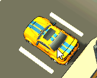

# TP_SmallCity

L'objectif de ce TP est de créer les intéractions visibles dans le gif. Les scripts sont déjà crées et contiennent certains éléments, mais sont en grande partie à remplir vous même.
Certaines notions n'ont pas étés vus en cours, ne paniquez pas et cherchez l'information dans la documentation Unity.
Les scripts sont déjà placés dans la scène.

## CarController

On travail dans le script *CarController*. Le but est de créer un composant permettant de controller une voiture (de manière très primitive). On ne cherche pas un comportement réaliste, simplement que la voiture avance avec la fléche avant, recule avec la flèche arrière, et tourne avec les flèches gauche et droite.
1. Compléter la fonction `ReadInputs()` pour qu'elle sauvegarde les inputs de l'utilisateur avec les flèches du clavier dans la variable `Vector2 inputs`.
2. Compléter la fonction `RotateCar()` pour qu'elle permette de pivoter la voiture (on ne veut simplement pas que la voiture puisse pivoter à l'arret).
3. Compléter la fonction `ApplyAccelération()` pour qu'elle permette de faire avancer la voiture en lui appliquant une force vers l'avant ou l'arrière en fonction des inputs de l'utilisateur.

## ClickToControl

On travail dans le script *ClickToControl*. Le but est d'activer (enable) le composant CarController de la voiture visée par la souris lors d'un click gauche. La fonction `SelectCar(CarController car)` permet d'activer le CarController qu'on lui passe en argument.
1. Détecter un click gauche de la souris.
2. Envoyer un raycast depuis la souris.
3. Accéder au composant *CarController* de l'objet touché.
4. Appeler la fonction `SelectCar(CarController car)` avec ce CarController.
On note que la fonction SelectCar va enable le CarController dans objets visés, donc les CarControllers doivent être désactivés de base dans la scène.

## OutlineFlash

On Travail dans le script *OutlineFlash*. Le but est de concevoir un effet de flash de l'outline d'une voiture lorsqu'elle est séléctionnée.

1. Compléter le script en utilisant les variables existantes pour générer cet effet de flash. Il n'est pas nescessaire de créer de variables supplémentaires, mais vous pouvez créer des fonctions et coroutines.
2. Modifier *ClickToControl* pour appeler `Flash()` via un message (`SendMessage(String methodName)`) lorsque la voiture est cliquée.

## EffectOnHighSpeedCollision

On travail dans le script *EffectOnHighSpeedCollision*.
Emettre un effet de particule lorsque deux voitures se cognent avec une vitesse d'impact suffisament grande, à la position de l'impact. On veut pouvoir simplement changer d'avis et déclancher cet effet plutôt quand une voiture rentre en collision avec un autre type d'objet, comme un arbre.
1. Découper la question en étapes simples à la manière de la question **ClickToControl**. Inclure ce découpage en commentaire dans le script.
2. Implémenter ces étapes.
